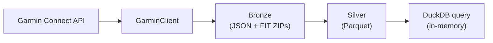

# Architecture

## Overview

own-garmin implements a medallion lakehouse pattern: Garmin Connect data lands as immutable raw JSON and FIT files in the Bronze layer, Polars transforms produce typed, hive-partitioned Parquet in the Silver layer, and DuckDB provides SQL access over the Parquet files without a server process. The same CLI and library code runs against a local filesystem or an S3-compatible object store — the `s3://` prefix in `OWN_GARMIN_DATA_DIR` is the only switch needed.

## Data flow diagram



## Layers

### Bronze

Bronze stores original, unmodified data from Garmin. It is strictly immutable: nothing downstream ever writes to or modifies it. If transformation logic changes, Silver is rebuilt from Bronze without touching Garmin's API.

Three categories are currently written:

| Category | Path pattern | Written by |
|---|---|---|
| `activities` | `{root}/bronze/activities/year=YYYY/month=MM/day=DD.json` | `src/own_garmin/bronze/activities.py` |
| `activity_details` | `{root}/bronze/activity_details/year=YYYY/month=MM/day=DD.json` | `src/own_garmin/bronze/activity_details.py` |
| `fit` | `{root}/bronze/fit/year=YYYY/month=MM/day=DD/{activity_id}.zip` | `src/own_garmin/bronze/fit.py` |

Writes are idempotent: `bronze/activities.py` reads any existing day-file, merges on `activityId` (new data wins), and rewrites atomically. Activity details and FIT ZIPs follow the same merge-on-key pattern via shared helpers in `src/own_garmin/bronze/_common.py`.

### Silver

Silver is the queryable layer: hive-partitioned Parquet files built deterministically from Bronze by pure-function transforms. It is fully rebuildable via `own-garmin process` without network access.

Two tables exist today:

**`activities`** — summary metrics per activity, partitioned by `year` / `month`.

- Source: `bronze/activities/**/*.json`
- Transform: `src/own_garmin/silver/activities.py:transform()`
- Schema: `activity_id` (Int64), `activity_type`, `start_time_local`, `start_time_utc`, `duration_sec`, `distance_m`, `avg_hr`, `max_hr`, `calories`, `elevation_gain_m`, `elevation_loss_m`, `start_lat`, `start_lon`, `year`, `month`
- Dedup: `unique(subset=["activity_id"], keep="last")`

**`fit_records`** — per-second telemetry decoded from FIT files, partitioned by `year` / `month`.

- Source: `bronze/fit/**/*.zip`
- Transform: `src/own_garmin/silver/fit_records.py:transform()`
- Schema: `activity_id` (Int64), `timestamp`, `heart_rate`, `cadence`, `speed`, `power`, `distance`, `altitude`, `position_lat`, `position_lon`, `year`, `month`
- GPS coordinates are stored in decimal degrees (semicircle → degree conversion factor: `180 / 2³¹`, applied at `src/own_garmin/silver/fit_records.py:12`)
- Dedup: `unique(subset=["activity_id", "timestamp"], keep="last")`

Both `rebuild()` functions call `storage.rmtree()` before writing, so the Silver directory is always replaced atomically.

### Query

`src/own_garmin/query.py` opens an in-memory DuckDB connection, discovers which Silver tables exist by globbing their Parquet files, registers each as a view with `hive_partitioning=True`, then executes the caller's SQL and returns a Polars DataFrame.

For S3 roots it additionally:

1. Installs and loads the `httpfs` and `aws` extensions.
2. Issues `CREATE OR REPLACE SECRET own_garmin_s3` using the `credential_chain` provider, so it honors the standard AWS credential chain (`AWS_ACCESS_KEY_ID`, `AWS_SECRET_ACCESS_KEY`, IAM roles, etc.).
3. Accepts `AWS_ENDPOINT_URL_S3` for non-AWS endpoints (MinIO, Ceph) and `AWS_REGION` (default `us-east-1`).
4. Sets a local temp directory (`paths.duckdb_temp_dir()`) so DuckDB has somewhere to spill for large result sets.

The connection is always closed in a `finally` block, even on query failure.

## Module map

| Module | Responsibility |
|---|---|
| `src/own_garmin/paths.py` | All path/URI construction — `bronze_path()`, `bronze_fit_path()`, `silver_path()`, `silver_glob()`, `session_dir()`, `duckdb_temp_dir()`. Returns plain strings so `s3://` is a drop-in swap. |
| `src/own_garmin/storage.py` | Local/S3 dispatch for text, bytes, existence checks, glob listing, rmtree, and `write_partitioned_parquet()`. `boto3` is imported lazily, so it is never required for local-only use. |
| `src/own_garmin/client/client.py` | `GarminClient` — session resume, 5-strategy login chain, token persistence, all API calls. |
| `src/own_garmin/client/strategies.py` | Five Cloudflare-evasion login strategies (portal+cffi, portal+requests, mobile+cffi, mobile+requests, widget+cffi). |
| `src/own_garmin/client/mfa_handlers.py` | `InteractiveMfaHandler` (stdin prompt) and `NtfyMfaHandler` (ntfy.sh publish + poll). |
| `src/own_garmin/client/constants.py` | DI client IDs, endpoint URLs, cffi availability flag, shared header builders. |
| `src/own_garmin/client/exceptions.py` | `GarminAuthenticationError`, `GarminConnectionError`, `GarminTooManyRequestsError`. |
| `src/own_garmin/bronze/activities.py` | Fetch + idempotent-merge activity summaries into Bronze. |
| `src/own_garmin/bronze/activity_details.py` | Fetch + idempotent-merge activity details (charts, metrics) into Bronze. |
| `src/own_garmin/bronze/fit.py` | Download + store per-activity FIT ZIPs into Bronze. |
| `src/own_garmin/bronze/_common.py` | Shared merge-on-key helpers used by all three Bronze writers. |
| `src/own_garmin/silver/activities.py` | `transform()` + `rebuild()` for the activities Silver table. |
| `src/own_garmin/silver/fit_records.py` | `transform()` + `rebuild()` for the fit_records Silver table. Decodes FIT via `garmin-fit-sdk`. |
| `src/own_garmin/query.py` | In-memory DuckDB session, S3 secret setup, view registration, SQL execution. |
| `src/own_garmin/cli.py` | Typer app: `login`, `ingest`, `process`, `query` commands. |

## Storage abstraction

`src/own_garmin/storage.py` is a thin dispatcher — every function checks `is_s3(path)` and routes to either a local `pathlib.Path` operation or a `boto3` call. `boto3` is never imported at module load time; it is imported lazily inside each S3 branch. This means installing the `s3` extra (`pip install own-garmin[s3]`) is only required when an `s3://` data root is actually used.

The trickiest case is `write_partitioned_parquet()`. Polars' built-in `write_parquet(partition_by=...)` works only on local paths. For S3, the function manually groups the DataFrame by the partition columns, serialises each group to an in-memory `BytesIO` buffer, and uploads it as `{base_prefix}/{col}=val/.../data.parquet` — reproducing the same hive layout Polars would produce locally. Callers and the query layer are unaware of this difference.

## Authentication and session management

`GarminClient` (`src/own_garmin/client/client.py`) resolves credentials in this order on construction:

1. **`GARMIN_TOKENS_JSON` env var** — a JSON string containing `di_token`, `di_refresh_token`, and `di_client_id`. Useful in CI/CD or containerised runs where writing to disk is not practical. The `own-garmin login --export-session` command prints this JSON to stdout for capture.

2. **On-disk token store** — `{session_dir()}/garmin_tokens.json` (mode `0600`, written atomically via `tempfile.mkstemp` + `os.replace`). Checked and refreshed on every run so that a valid cached session avoids triggering Cloudflare.

3. **5-strategy login chain** — tried only if neither of the above succeeds. Strategies in order (cffi variants require the `curl_cffi` optional dependency):
   - `portal+cffi`
   - `portal+requests`
   - `mobile+cffi`
   - `mobile+requests`
   - `widget+cffi`

   Each strategy may sleep up to `LOGIN_DELAY_MAX_S` seconds for Cloudflare evasion; a full cold login can take several minutes. A `GarminAuthenticationError` (bad credentials) short-circuits the chain immediately.

4. **Token refresh** — before every API request the client checks the JWT `exp` claim. If expiry is within 15 minutes it calls `_refresh_di_token()` and persists the new token pair.

**MFA** is interactive by default (stdin prompt). Pass `--remote-mfa` to `own-garmin login` to use `NtfyMfaHandler` (`src/own_garmin/client/mfa_handlers.py`): it publishes a push notification to an ntfy.sh topic (`NTFY_TOPIC` env var) and polls for a 6-digit reply with a 5-minute timeout.

## Deployment

A multi-stage `Dockerfile` is included for containerised use:

- **Builder stage** — uses the official `uv` image to install dependencies with the `s3` extra baked in.
- **Runtime stage** — slim Python image, non-root `app` user, `ENTRYPOINT ["own-garmin"]`.

```bash
docker build -t own-garmin .
docker run --rm \
  -e GARMIN_EMAIL \
  -e GARMIN_PASSWORD \
  -v $(pwd)/data:/app/data \
  own-garmin ingest --since 2025-01-01
```

`docker-compose.yml` adds a local MinIO service and a bootstrap container that pre-creates the test bucket, enabling end-to-end validation of the S3 code path without an AWS account.

## Design rules

- **No hardcoded paths** — all path and URI construction goes through `src/own_garmin/paths.py`. Downstream code never concatenates strings with `data/` or `~/.config/`.
- **Bronze is immutable** — transformation failures mean rebuild Silver, not re-ingest Bronze. Re-ingesting without cause risks Garmin rate-limits and Cloudflare friction.
- **Silver transforms are pure functions** — `transform(paths) -> pl.DataFrame` has no side effects. Given the same Bronze input, the output is always identical. Tests can exercise them without a network or filesystem.
- **Prefer token resume before fresh login** — the login chain is expensive (sleeps, Cloudflare evasion). Always try the cached token or env side-load first.

## See also

- [ADR-001: Local Data Lakehouse Architecture](adrs/ADR-001-garmin-lakehouse.md) — original architecture decision record explaining the tradeoffs behind these choices.
